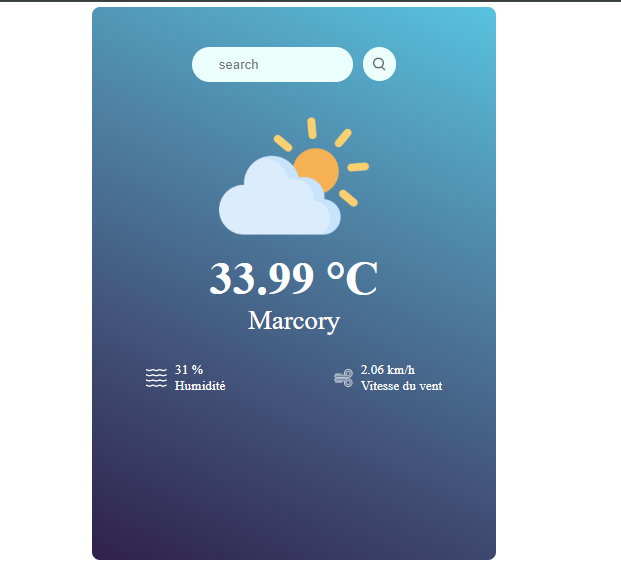

# Weather App

## Description

This is a simple weather application built with React. It fetches weather data from an API and displays it in a user-friendly format.

## Features

- Displays current temperature
- Shows humidity level
- Provides wind speed
- Shows the location of the weather data

## Installation

To install the application, follow these steps:

1. Clone the repository: `git clone https://github.com/yourusername/weather-app.git`
2. Navigate into the directory: `cd weather-app`
3. Install dependencies: `npm install`
4. Start the application: `npm run dev`

## Usage

After starting the application, navigate to `http://localhost:5173/` in your web browser. The application will automatically fetch and display the current weather data.

## Contributing

Pull requests are welcome. For major changes, please open an issue first to discuss what you would like to change.

